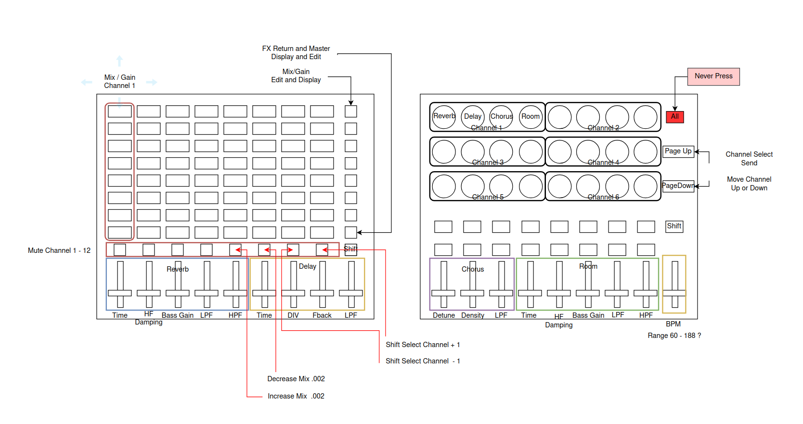
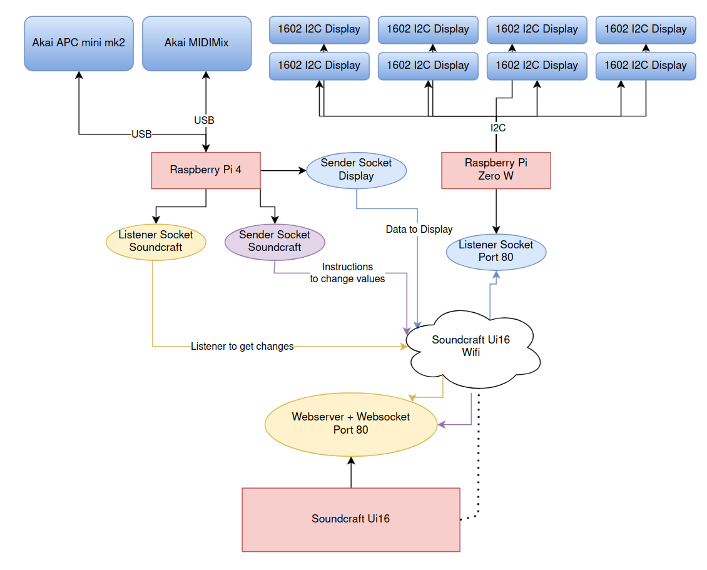

# MIDI2Soundcraft

This project is my solution to create a bridge between my MIDI devices (APC mini mk2 and MIDIMix) to Soundcraft Ui16 Mixer.
Furthermore I created a Display by connecting 8 I2C 1602 LCDs.

This project is running on a Raspberry Pi 4 Model B. Both MIDI devices are connected.

The Display is connected to a Raspberry Pi Zero W.

Both devices join the Soundcraft Ui16 network and setting static IPs you can see in this project.
```
Raspberry Pi 4 Model B: 10.10.1.11
Raspberry Pi Zero W   : 10.10.1.10
```

# Akai APC mini mk2 and MIDIMix Controls


# Project schema


# Refs
* [Display Library](https://github.com/dhoessl/HD44780_1620_display_matrix)
* [Soundcraft Library](https://github.com/dhoessl/soundcraft_ui16)
* [MIDI driver Library](https://github.com/dhoessl/apc-mini-py)

# Required Modules and libraries
```
pip3 install -U git+https://github.com/dhoessl/apc-mini-py
pip3 install -U git+https://github.com/dhoessl/HD44780_1602_display_matrix
pip3 install -U git+https://github.com/dhoessl/soundcraft_ui16
pip3 install scipy
pip3 install mido
```
